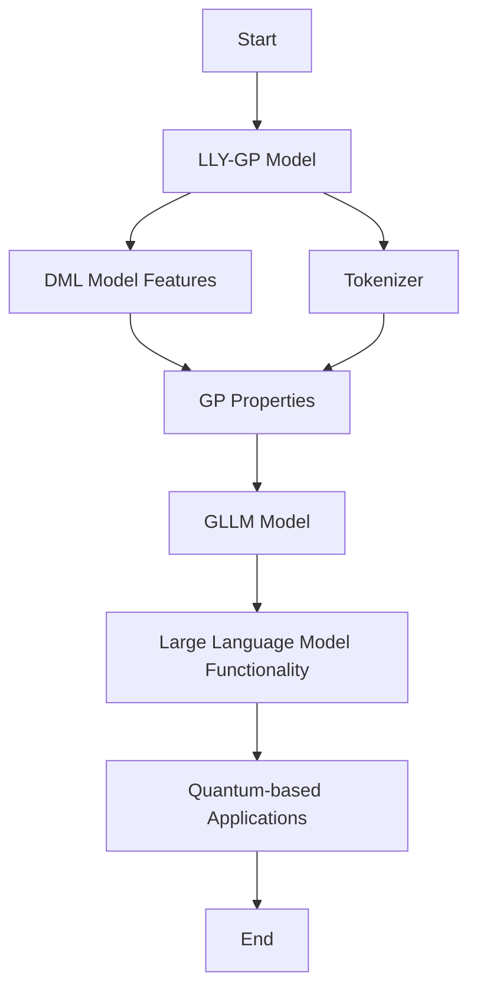

# Introduction

**LLY-GP** is part of the [**LILY Project**](https://www.lilyqml.de) and focuses on optimization parameter-based quantum circuits. It enhances the efficiency of quantum algorithms by fine-tuning parameters of quantum gates. **GP** stands for **Generativ Qubit Processing**, which assigns each word the state of a multi-qubit system and recognizes words through a quantum machine learning process. This approach leverages gradient-based optimization techniques to improve the performance of quantum circuits.

The primary goal of **LLY-GP** is to recognize and assign languages, making it a foundational element in the development of language-aware models. As the LILY Project evolves, **LLY-GP** will become increasingly important, serving as a critical component in more advanced quantum machine learning models.

LLY-GP is available on the [LILY QML platform](https://www.lilyqml.de), making it accessible for researchers and developers.

For inquiries or further information, please contact: [info@lilyqml.de](mailto:info@lilyqml.de).

## Contributors

| Role                     | Name          | Links                                                                                                                |
|--------------------------|---------------|----------------------------------------------------------------------------------------------------------------------|
| Project Lead             | Leon Kaiser   | [ORCID](https://orcid.org/0009-0000-4735-2044), [GitHub](https://github.com/xleonplayz)                              |
| Inquiries and Management | Raul Nieli    | [Email](mailto:raul.nieli@lilyqml.de)                                                                                |
| Supporting Contributors  | Eileen Kühn   | [GitHub](https://github.com/eileen-kuehn), [KIT Profile](https://www-kseta.ttp.kit.edu/fellows/Eileen.Kuehn/)        |
| Supporting Contributors  | Max Kühn      | [GitHub](https://github.com/maxfischer2781)                                                                          |

## Table of Contents

1. [Model Usage](#model-usage)
2. [Functionality](#functionality)
3. [Optimization](#optimization)
4. [Collaboration](#collaboration)

## Model Usage

**LLY-GP** is a Quantum Machine Learning model that plays a crucial role in the development of future models within the **LILY Project**. It combines the gate properties of the **DML model** with a tokenizer, creating a robust foundation for future applications. This model acts as a precursor to the **GLLM model**, which leverages the properties of **GP** to function like a Large Language Model (LLM).

By integrating these innovative techniques, **LLY-GP** significantly enhances the efficiency and performance of language models. With its ability to merge quantum mechanics and machine learning, **LLY-GP** is set to play a central role in the development of new quantum-based applications and systems.

## Functionality

The model is based on **Generativ Qubit Processing (GP)**, which assigns each word the state of a multi-qubit system. This method enables precise word recognition and processing through quantum-based machine learning techniques.

## Optimization

Optimization of the model is achieved by fine-tuning the parameters of quantum gates. This enhances the efficiency of quantum algorithms and allows for highly accurate results in language recognition.

## Collaboration

We welcome and encourage public collaboration on this GitHub project. If you're interested in contributing, there are several ways you can get involved:

### 1. **Contact the Team**

If you have questions or suggestions, feel free to reach out to our team at any time. We're eager to hear your thoughts and are open to discussions about potential improvements or new ideas for the project.

### 2. **Explore the Repository**

Dive into the repository to understand the current state of the project. You'll find detailed documentation and examples that will help you get up to speed quickly. We recommend checking out the following resources:

- **README**: Provides an overview of the project and guides you on getting started.
- **Documentation**: Offers detailed information about the project's architecture, modules, and usage.

### 3. **Pick a Task or Feature**

Identify tasks or features that interest you and feel free to take them on. You can find a list of tasks or features in our [issue tracker](#), where we regularly update the project's current needs and priorities. Here’s how you can proceed:

- **Comment on an Issue**: Let us know which task you're interested in by commenting on the relevant issue.
- **Create a Pull Request**: Once you've made changes, submit a pull request. Our team will review your contributions and provide feedback.

### 4. **Join the Community**

Engage with other contributors in the project's discussions. This is a great way to exchange ideas, ask questions, and collaborate on solutions. You can:

- **Participate in Discussions**: Join ongoing conversations in the [discussion board](#).
- **Collaborate on Projects**: Work with others to tackle complex issues and develop new features.

### 5. **Contributing Guidelines**

We have a set of guidelines to help you contribute effectively:

- **Fork the Repository**: Start by forking the repository to your own GitHub account.
- **Create a Branch**: Make your changes in a dedicated branch.
- **Commit Your Changes**: Use clear and concise commit messages.
- **Push and Pull Request**: Push your changes and create a pull request for review.

By contributing, you become a part of our community, helping us improve and expand the project. We value every contribution and look forward to collaborating with you!

If you're ready to start, head over to our [contributing guide](#) for detailed instructions. Together, we can make this project even better!

